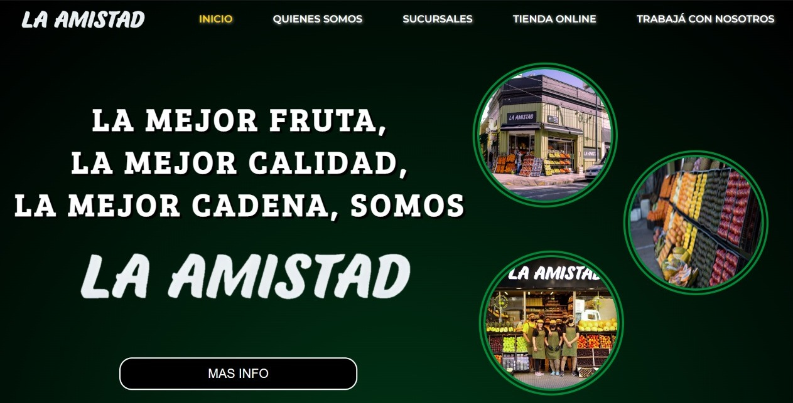
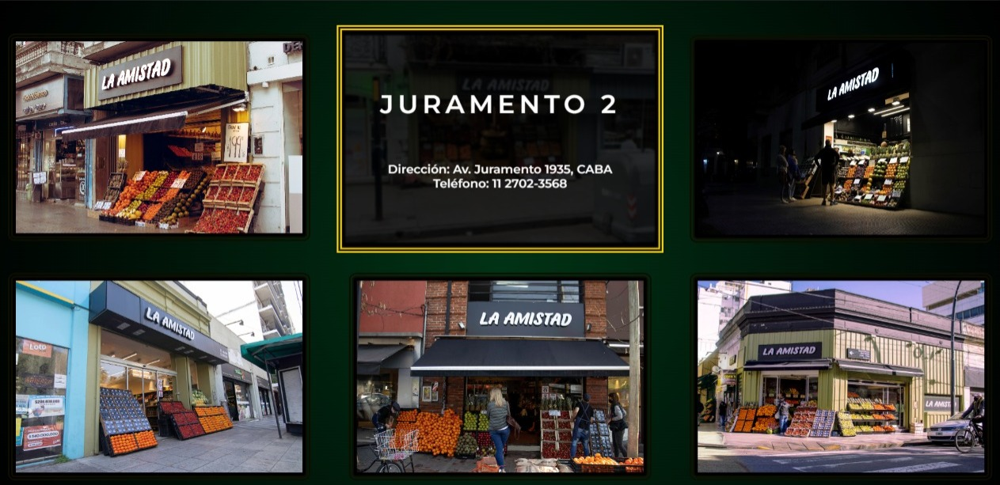
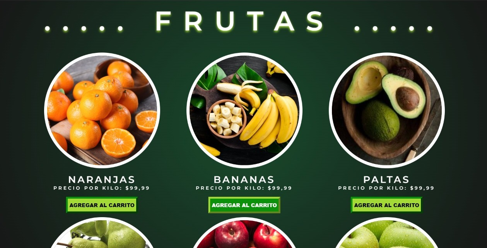
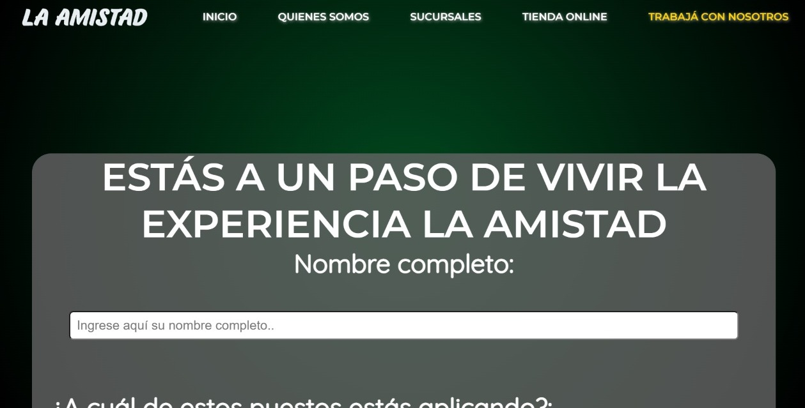
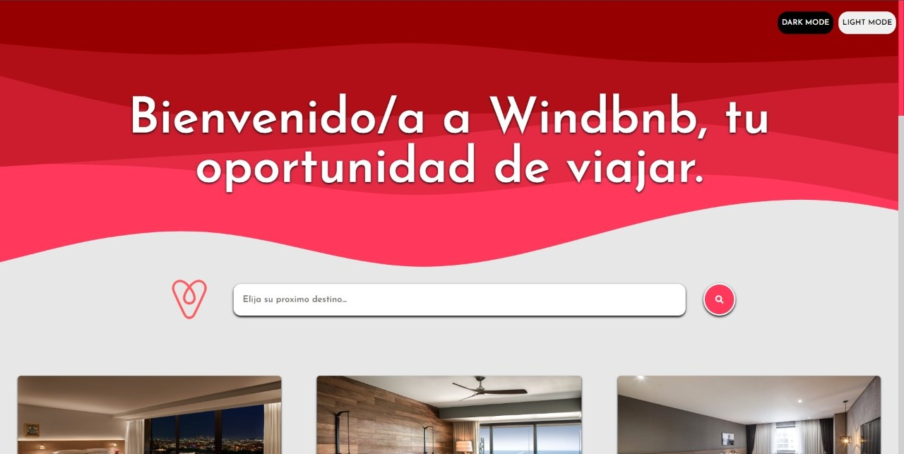
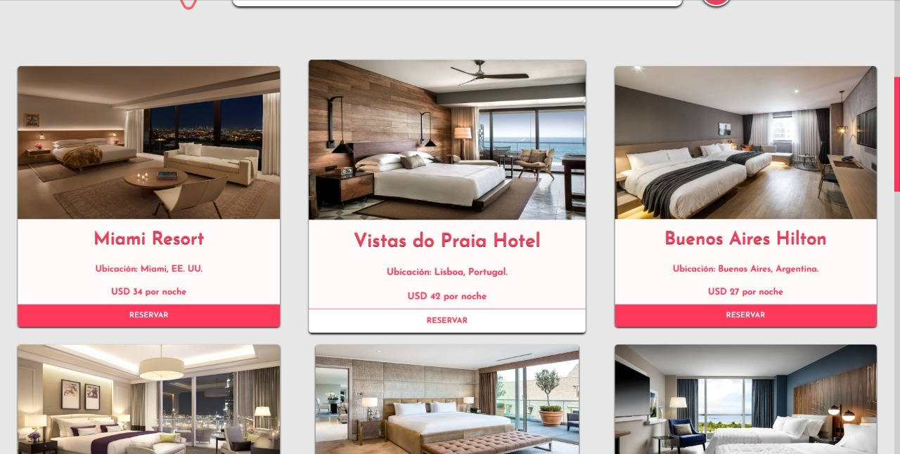
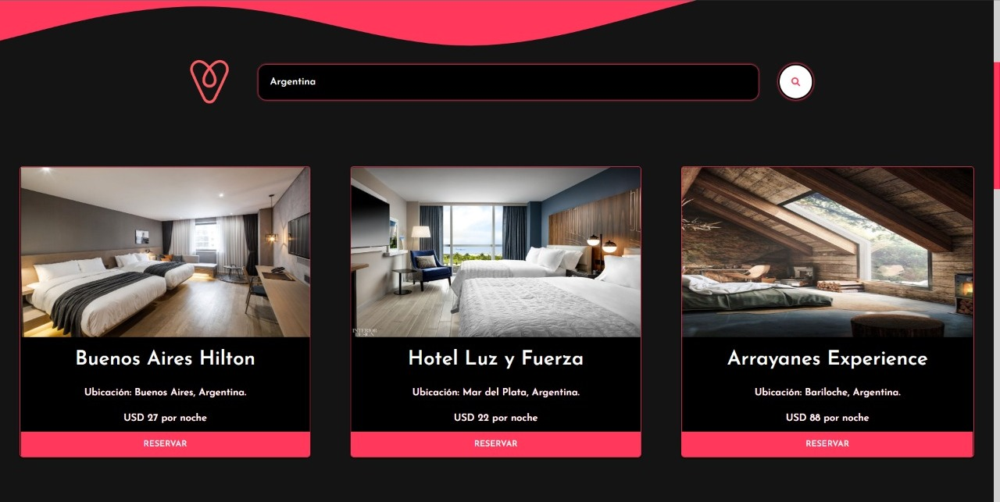
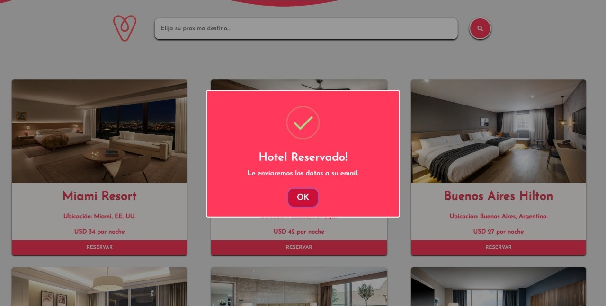

# Hi there! I'm Lucas, And I'm a Front-End developer. 💻
### About me:

I've worked as an administrative for four years, so I learned to be <strong>organized, effective, problem-solving</strong> & also know which things I have to <strong>prioritize</strong> the most, so the job can be done <strong>precisely and on time.</strong>

# PROJECTS

### 02/2022, LA AMISTAD

Development of a Web site using HTML and CSS for the Front-End, compiled the CSS file with SASS. 
The site is based on a presentation model of <strong>a greengocers chain</strong>, Including a form section to work with them, an ecommerce section, and a Markets section where you can meet each chain market, and communicate with each one of them, in case the client need a personalized experience.

Here is the <a href="https://github.com/lucasszamora/La-Amistad-Project">Link for this project.</a>

### 06/2022, Windbnb

Development of a Web page using HTML, CSS & JS for the Front-End.
This site is based on a Hotel Reservation page where you can find several hotels throughout the entire world.
The page is mainly focused on JavaScript. 

Here are some <i>features</i> that this project has: 

~ Use of addEventListeners to the searchbar, and all the buttons. 
~ Usage of Session Storage for dark and light theme. 
~ Libraries such as Sweet Alert for the Reservation buttons. 
~ A local API (JSON) Fetched for the hotel's section.

Here is the <a href="https://github.com/lucasszamora/proyecto-final-JS-Zamora">Link for this project.</a>

## If you want to contact me: 
<strong>Mail: </strong><a href="mailto:lucaszam00@hotmail.com"><i>lucaszam00@hotmail.com</i></a> 

<strong>LinkedIn: </strong><a href="https://www.linkedin.com/in/-lucas-zamora/"><i>-lucas-zamora</i> 
